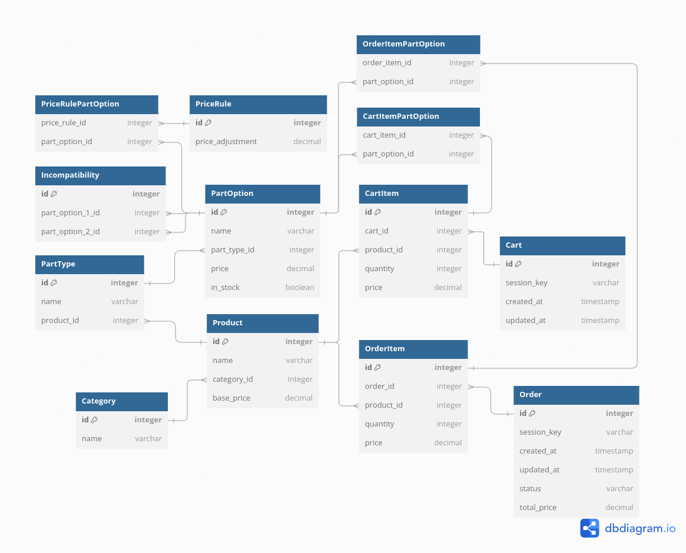

# Project ERD

Here's the simple ERD

Here's a detailed description of the entities and their relationships:

## Entities (Tables)

### Category

- **id**: integer (primary key)
- **name**: varchar

### Product

- **id**: integer (primary key)
- **name**: varchar
- **category_id**: integer (foreign key to Category)
- **base_price**: decimal

### PartType

- **id**: integer (primary key)
- **name**: varchar
- **product_id**: integer (foreign key to Product)

### PartOption

- **id**: integer (primary key)
- **name**: varchar
- **part_type_id**: integer (foreign key to PartType)
- **price**: decimal
- **in_stock**: boolean

### Incompatibility

- **id**: integer (primary key)
- **part_option_1_id**: integer (foreign key to PartOption)
- **part_option_2_id**: integer (foreign key to PartOption)

### PriceRule

- **id**: integer (primary key)
- **price_adjustment**: decimal

### PriceRulePartOption (Junction Table)

- **price_rule_id**: integer (foreign key to PriceRule)
- **part_option_id**: integer (foreign key to PartOption)

### Order

- **id**: integer (primary key)
- **session_key**: varchar
- **created_at**: timestamp
- **updated_at**: timestamp
- **status**: varchar
- **total_price**: decimal

### OrderItem

- **id**: integer (primary key)
- **order_id**: integer (foreign key to Order)
- **product_id**: integer (foreign key to Product)
- **quantity**: integer
- **price**: decimal

### OrderItemPartOption (Junction Table)

- **order_item_id**: integer (foreign key to OrderItem)
- **part_option_id**: integer (foreign key to PartOption)

### Cart

- **id**: integer (primary key)
- **session_key**: varchar
- **created_at**: timestamp
- **updated_at**: timestamp

### CartItem

- **id**: integer (primary key)
- **cart_id**: integer (foreign key to Cart)
- **product_id**: integer (foreign key to Product)
- **quantity**: integer
- **price**: decimal

### CartItemPartOption (Junction Table)

- **cart_item_id**: integer (foreign key to CartItem)
- **part_option_id**: integer (foreign key to PartOption)

## Relationships

1. **Category - Product**: One-to-Many
   - A Category can have multiple Products
   - A Product belongs to one Category

2. **Product - PartType**: One-to-Many
   - A Product can have multiple PartTypes
   - A PartType belongs to one Product

3. **PartType - PartOption**: One-to-Many
   - A PartType can have multiple PartOptions
   - A PartOption belongs to one PartType

4. **PartOption - Incompatibility**: Many-to-Many
   - A PartOption can be incompatible with multiple other PartOptions
   - An Incompatibility record links two PartOptions

5. **PartOption - PriceRule**: Many-to-Many
   - A PartOption can be associated with multiple PriceRules
   - A PriceRule can apply to multiple PartOptions
   - This relationship is implemented through the PriceRulePartOption junction table

6. **Order - OrderItem**: One-to-Many
   - An Order can have multiple OrderItems
   - An OrderItem belongs to one Order

7. **OrderItem - Product**: Many-to-One
   - An OrderItem is associated with one Product
   - A Product can be in multiple OrderItems

8. **OrderItem - PartOption**: Many-to-Many
   - An OrderItem can have multiple PartOptions
   - A PartOption can be in multiple OrderItems
   - This relationship is implemented through the OrderItemPartOption junction table

9. **Cart - CartItem**: One-to-Many
   - A Cart can have multiple CartItems
   - A CartItem belongs to one Cart

10. **CartItem - Product**: Many-to-One
    - A CartItem is associated with one Product
    - A Product can be in multiple CartItems

11. **CartItem - PartOption**: Many-to-Many
    - A CartItem can have multiple PartOptions
    - A PartOption can be in multiple CartItems
    - This relationship is implemented through the CartItemPartOption junction table

This ERD represents a complex e-commerce system for customizable products (like bicycles). It allows for product categorization, customizable parts, pricing rules, incompatibility checks, and both cart and order management. The use of junction tables (PriceRulePartOption, OrderItemPartOption, CartItemPartOption) enables flexible many-to-many relationships between entities.
