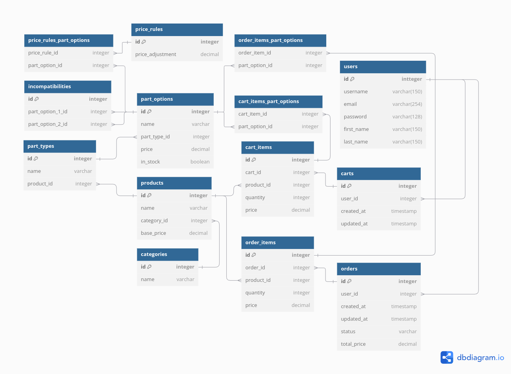

# Project ERD

Here's the simple ERD

Here's a detailed description of the entities and their relationships:

1. User (Django's built-in User model)

   - Fields: id, username, email, password, etc.
   - Relationships:
     - One-to-Many with Order
     - One-to-One with Cart

2. Category

   - Fields: id, name
   - Relationships:
     -One-to-Many with Product

3. Product

   - Fields: id, name, base_price
   - Relationships:
     - Many-to-One with Category
     - One-to-Many with PartType

4. PartType

   - Fields: id, name
   - Relationships:
     - Many-to-One with Product
     - One-to-Many with PartOption

5. PartOption

   - Fields: id, name, price, in_stock
   - Relationships:
     - Many-to-One with PartType
     - Many-to-Many with PriceRule
     - Many-to-Many with OrderItem
     - Many-to-Many with CartItem

6. Incompatibility

   - Fields: id
   - Relationships:
     - Many-to-One with PartOption (twice, as part_option_1 and part_option_2)

7. PriceRule

   - Fields: id, price_adjustment
   - Relationships:
     -Many-to-Many with PartOption

8. Order

   - Fields: id, created_at, updated_at, status, total_price
   - Relationships:
     - Many-to-One with User
     - One-to-Many with OrderItem

9. OrderItem

   - Fields: id, quantity, price
   - Relationships:
     - Many-to-One with Order
     - Many-to-One with Product
     - Many-to-Many with PartOption

10. Cart

    - Fields: id, created_at, updated_at
    - Relationships:
      - One-to-One with User
      - One-to-Many with CartItem

11. CartItem
    - Fields: id, quantity, price
    - Relationships:
      - Many-to-One with Cart
      - Many-to-One with Product
      - Many-to-Many with PartOption

Key Relationships:

- Products are categorized and can have multiple customizable part types.

- Each part type has multiple options, which have individual prices.

- Incompatibilities between part options are tracked.

- Price rules can adjust the final price based on combinations of part options.

- Users can have a cart with multiple items, each representing a product with selected options.

- Orders consist of multiple order items, each representing a product with selected options.

This ERD represents a flexible system for customizable products, with features for pricing rules, incompatibilities, and order management. It allows for complex product configurations while maintaining a clear structure for order processing and inventory management.
